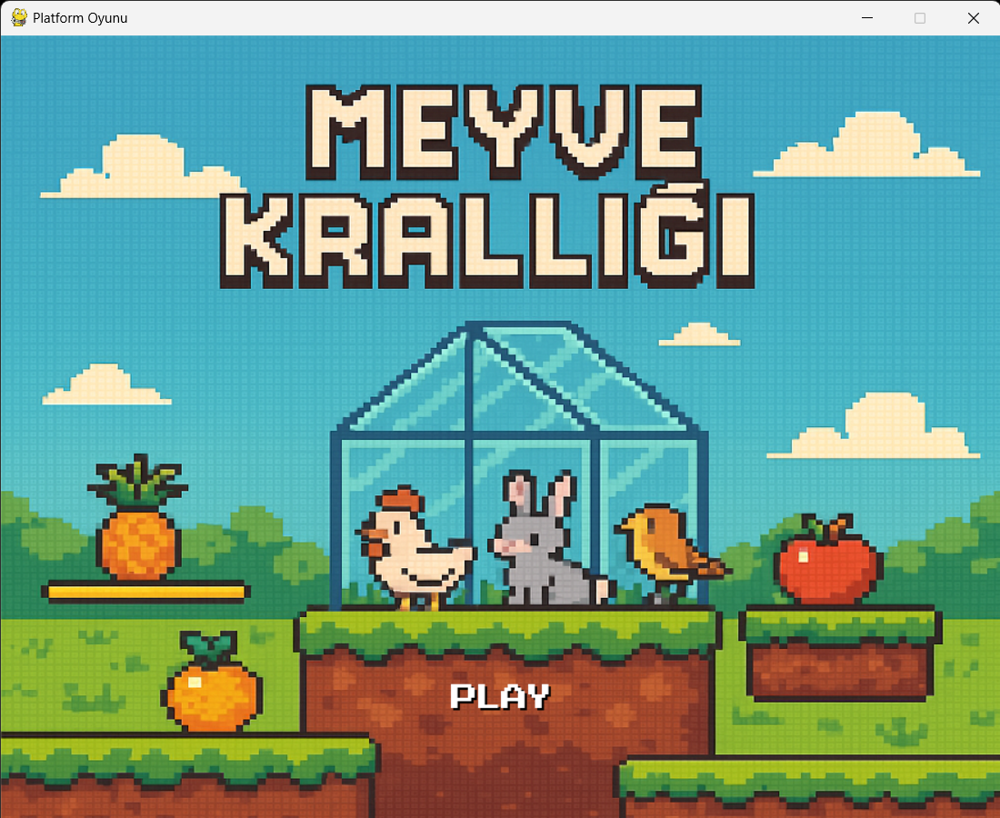
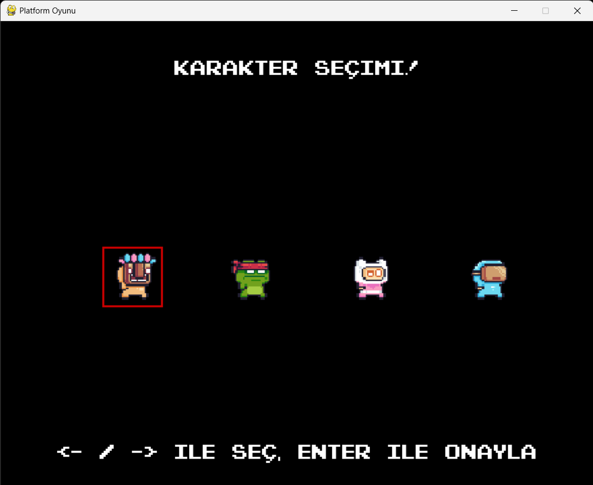
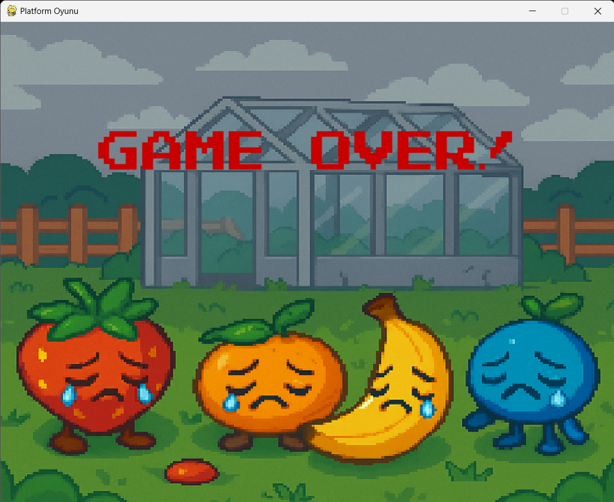
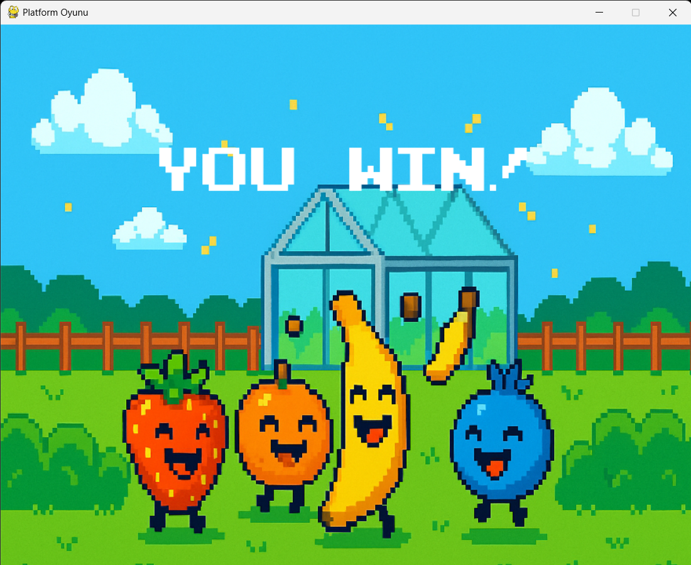

# 📝 Platform Adventure Game - Proje Raporu


---

## 📌 Proje Tanımı

Bu proje, Python programlama dili ve Pygame kütüphanesi kullanılarak geliştirilmiş,  
kullanıcıya karakter seçimi, meyve toplama, düşmanlardan kaçma ve bölümleri tamamlama deneyimi sunan bir **2D Platform Oyunudur**.

---

## 🎯 Oyun Amacı

- Oyuncunun tüm meyveleri toplayarak  
- Düşmanlara yakalanmadan  
- Bayrağa ulaşması ve tüm seviyeleri başarıyla tamamlaması hedeflenir.

---

## 🖼️ Oyun Görselleri

### 🎮 Başlangıç Ekranı


### 🧍‍♂️ Karakter Seçimi


### 🍓 Kaybetme 


### 🏆 Kazanma Ekranı



---

## ⚙️ Teknolojiler & Araçlar

- **Python 3.10+**
- **Pygame Kütüphanesi**
- **Markdown Dili** (Bu belge için kullanıldı)


---

## 🕹️ Oyun Özellikleri

- 4 Farklı **Karakter Seçimi**
- Ananas, Elma, Çilek gibi **toplanabilir meyveler**
- **Çift Zıplama Mekaniği**
- **Düşmanlardan Kaçınma** ve **Animasyonlu Düşmanlar**
- **Karanlık Görüş Alanı** (Level 3)
- **Oyun Sonu Ekranları** (Kazanan/Kaybeden)

---

## 🔧 Kurulum ve Çalıştırma

1. Pygame kütüphanesini yükleyin:
    ```bash
    pip install pygame
    ```
2. Projeyi çalıştırın:
    ```bash
    python oyun01.py
    ```

---

## 🎮 Oyun Kontrolleri

| Tuş / Eylem          | Açıklama                     |
|---------------------|------------------------------|
| **← / →**            | Hareket                      |
| **SPACE**            | Zıplama / Çift zıplama       |
| **Enter**            | Karakter seçimi onayı        |
| **Mouse Click**      | Menü butonlarına tıklama     |


---


